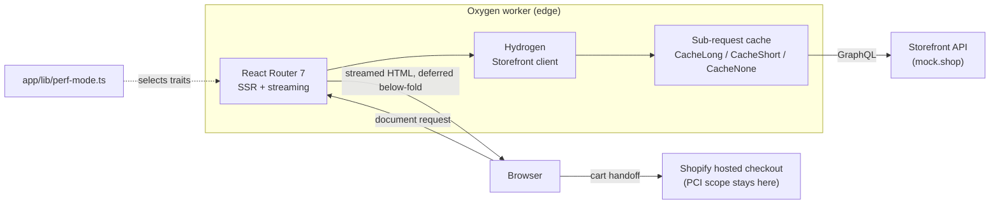

# Shopify Headless Perf Lab

A headless Shopify storefront built on **Hydrogen + React Router 7**, running on
the Oxygen worker runtime — where every performance claim is a command you can
re-run, not a screenshot.

The same storefront ships in two modes. `optimized` is how it should go out.
`baseline` re-introduces five specific regressions that real app-heavy Shopify
themes have. Both are measured by one script, so the difference between them is
an observation rather than an assertion.

```bash
git clone <this-repo>
cd shopify-headless-perf-lab
npm install
npm run dev            # http://localhost:3000
```

**No Shopify account. No API token. No dev store.** The storefront runs against
[`mock.shop`](https://mock.shop), Shopify's public Storefront API mock, so it
works on a clean machine in under a minute — including in CI, with no secrets.
([ADR 0001](docs/adr/0001-run-against-mock-shop.md))

---

## Architecture



Critical above-the-fold data is awaited; everything below the fold is deferred
and streamed, which is why the footer and recommended products do not block
time-to-first-byte.

Checkout is deliberately *not* headless — see
[ADR 0002](docs/adr/0002-keep-checkout-on-shopify.md).

---

## The two perf modes

Selected at runtime by `PERF_MODE`. Every difference between them lives in one
table in [`app/lib/perf-mode.ts`](app/lib/perf-mode.ts) — deliberately, so the
comparison can be audited rather than taken on trust.

| Lever | `optimized` | `baseline` | Why it matters |
|---|---|---|---|
| CDN preconnect | present | removed | A TLS round trip before the LCP image can start |
| Hero image | `eager` + `fetchpriority=high` | `lazy` + `auto` | Lazy-loading the LCP element defeats the preload scanner |
| `sizes` hint | viewport-aware | `100vw` | Mobile downloads a desktop-width image |
| Layout reservation | aspect ratio set | absent | The usual cause of a bad CLS score |
| Third-party app script | absent | synchronous in `<head>` | Reviews / popup / upsell bundles — the biggest real-world cost |
| Storefront API cache | `CacheLong` / `CacheShort` | `CacheNone` | Warm vs cold TTFB |

Reproduce the comparison:

```bash
npm run build
npm run perf           # both modes, 3 Lighthouse runs per URL, median
```

Results are written to `docs/perf/latest.md` and `docs/perf/latest.json`.
Mobile emulation with default throttling (4× CPU, Slow 4G) — desktop numbers
flatter every storefront and hide exactly the main-thread cost this comparison
is about.

To see a single mode in a browser, set `PERF_MODE` in `.env` and run
`npm run preview`. The rendered mode is visible as `<html data-perf-mode="…">`.

---

## Budgets are enforced, not admired

[`.github/workflows/lighthouse.yml`](.github/workflows/lighthouse.yml) runs
Lighthouse CI on every pull request against the thresholds in
[`lighthouserc.json`](lighthouserc.json):

| Assertion | Threshold | Level |
|---|---|---|
| Performance category | ≥ 0.90 | error |
| Accessibility category | ≥ 0.95 | error |
| SEO category | ≥ 0.95 | error |
| LCP | ≤ 2500 ms | error |
| CLS | ≤ 0.10 | error |
| Total Blocking Time | ≤ 300 ms | error |
| Unsized images | none | error |

A regression fails the pull request. That is the point — a budget nobody
enforces is a preference.

---

## Decision records

Short, and each one names what was given up.

- [0001 — Run against mock.shop, not a private dev store](docs/adr/0001-run-against-mock-shop.md)
- [0002 — Keep checkout on Shopify](docs/adr/0002-keep-checkout-on-shopify.md)
- [0003 — Ship two perf modes so the numbers can be reproduced](docs/adr/0003-baseline-vs-optimized-perf-modes.md)
- [0004 — Commit `.env`](docs/adr/0004-commit-the-env-file.md)

---

## Stack

TypeScript · React · Hydrogen (Oxygen worker runtime) · React Router 7 ·
Storefront API (GraphQL) with generated types · Vite · Lighthouse CI ·
GitHub Actions

```
app/
  lib/perf-mode.ts          the two modes, in one auditable table
  routes/                   file-based routes (flatRoutes)
    perf-sim.blocking-app[.js].tsx   simulated third-party app bundle
  components/
scripts/perf-compare.mjs    measures both modes, writes docs/perf/
docs/adr/                   decision records
lighthouserc.json           enforced budgets
```

---

## Limits, and what I would do differently at scale

Worth stating plainly, because a project that lists no limits usually has not
looked for them.

- **`mock.shop` is read-only.** Cart mutations render and behave correctly on
  the client, but no checkout can complete. Customer Accounts, Markets, and
  Shopify Functions need a real store and are not exercised here.
- **The catalog is tiny.** Nothing here demonstrates behaviour at 100k SKUs,
  where collection pagination, faceted filtering, and sitemap generation become
  the actual problems.
- **The third-party script is a stand-in.** It reproduces the two costs that
  matter — network latency before the parser continues, and main-thread time on
  execution — but not any specific vendor's behaviour.
- **Lighthouse is noisy.** The harness takes the median of several runs, which
  is enough to show the shape of a difference and not enough to call a 3%
  change a regression. Field data (CrUX / RUM) is what a production storefront
  should be governed by; lab numbers are a pre-merge gate, not a substitute.
- **Production branches for measurement.** `perf-mode.ts` is complexity that
  exists only to demonstrate a difference. On a client codebase this would be
  the wrong trade — there, the baseline is the site you are replacing.

---

## Development notes

- `npm run typecheck` — route typegen, then `tsc --noEmit`
- `npm run codegen` — regenerate Storefront API types after editing a query
- React is pinned to 18.x to match what Hydrogen 2026.4 is tested against.
- **Windows:** if `npm run dev` or `npm run preview` returns `500` on static
  assets, with `ConnectEx(): Access is denied` in the server log, a local
  firewall or endpoint-security policy is blocking the workerd runtime's
  loopback sockets. This is environmental, not a defect in the app — allow
  `workerd.exe` through, or run under WSL2.
